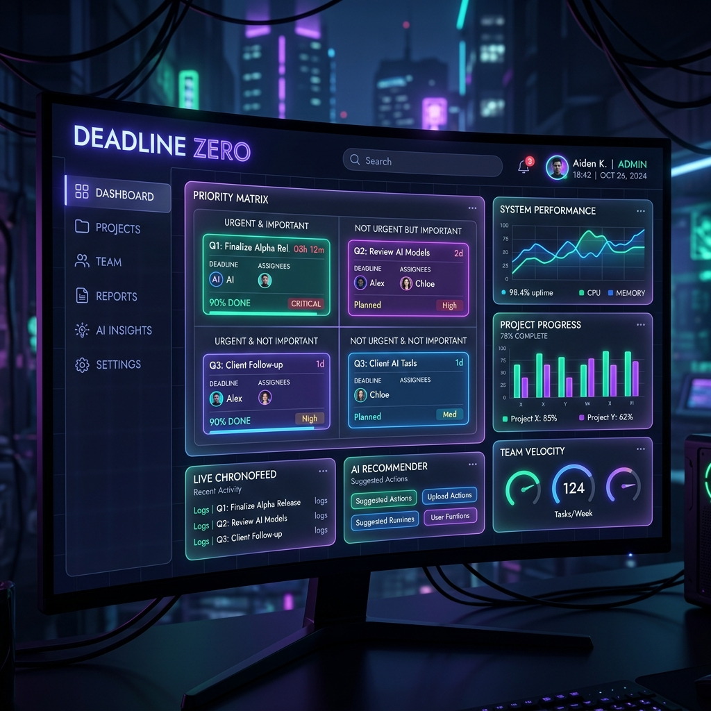
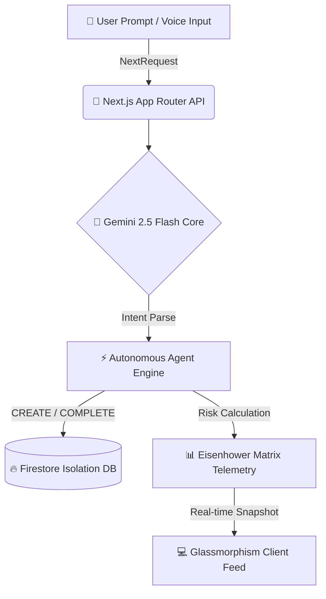

<p align="center">
  
</p>

<p align="center">
  <a href="https://github.com/krish-singh-dev/DeadlineZero">
    
  </a>
</p>

<p align="center">
  
  
  
  
  
  
</p>

---

<p align="center">
  
</p>

---

## 🌟 Overview

> **DeadlineZero** is a state-of-the-art, zero-trust autonomous project management platform built specifically for high-velocity entrepreneurs, creators, and developers. It replaces static to-do lists with **live risk telemetry**, attaching dynamic urgency coefficients and predictive slippage buffers to every sprint task.

Traditional productivity tools track what you *hope* to do. **DeadlineZero** actively intervenes to ensure you *actually ship it*.

---

## ⚡ Key Autonomous AI Differentiators

<div align="center">

| 🧠 Autonomous Agent | 🎯 Mission Capability | 🎨 UI / UX Semantics |
| :--- | :--- | :--- |
| **🤖 Conversational Co-Pilot** | Natural language sprint scheduling, live database mutations, & voice transcription. | Glowing neon indigo chat bubbles & real-time toast feedback. |
| **📈 Autonomous Risk Engine** | Dynamically calculates `0–100` urgency drift scores based on estimation factor math. | Color-coded Eisenhower tiers 🟢 Green / 🟡 Yellow / 🟠 Orange / 🔴 Red. |
| **✨ AI Task Decomposer** | Breaks down intimidating monolithic projects into 3–5 bite-sized sprint steps. | Smooth framer-motion collapsible step accordions. |
| **🔄 Telemetry Velocity Loop** | Calibrates historical user procrastination coefficients to recalibrate slippage margins. | Real-time burn-down completion telemetry gauges. |
| **🌅 Morning Briefing Agent** | Synthesizes a daily executive briefing and pre-locks peak energetic focus hours. | Ambient glassmorphism hero banner with glowing neon blurs. |

</div>

---

## 🎨 Rich Aesthetic & Design Philosophy

DeadlineZero is engineered to wow at first glance:
* **🌌 Cyberpunk Dark Mode:** Deep `#0B0B10` backgrounds paired with vibrant neon indigo (`#8B5CF6`), emerald (`#10B981`), and amber (`#F59E0B`) accents.
* **🔮 Glassmorphism UI:** Translucent backdrops, subtle micro-borders (`border-white/5`), and ambient multi-color light blurs.
* **⚡ Micro-Animations:** Responsive hover glows, pulsing risk badges, animated progress bars, and fluid layout transitions via `framer-motion`.

---

## 🚀 Quickstart & Setup

### 1️⃣ Clone the Repository
```bash
git clone https://github.com/krish-singh-dev/DeadlineZero.git
cd DeadlineZero
```

### 2️⃣ Install Dependencies
```bash
npm install
```

### 3️⃣ Configure Environment Secrets
Create a `.env` file in the root directory (refer to `.env.example`):
```env
PORT=8080
NODE_ENV=development

# Google DeepMind Gemini Reasoning Engine
GEMINI_API_KEY="AIzaSyYourActualGeminiKeyHere..."

# Firebase Client & Admin Credentials
NEXT_PUBLIC_FIREBASE_PROJECT_ID="deadlinezero-574ba"
```

### 4️⃣ Launch Co-Pilot Command Center
```bash
npm run dev
```

Visit [http://localhost:3000](http://localhost:3000) to enter your command center.

---

## 📐 Architecture & Telemetry Pipeline



---

<p align="center">
  
</p>
