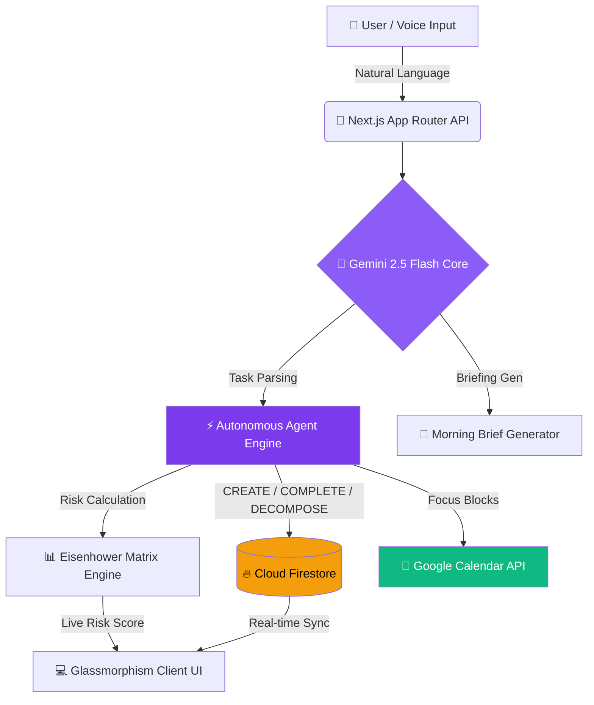

<p align="center">
  
</p>

<p align="center">
  <a href="https://deadlinezero-240522717078.us-central1.run.app/" target="_blank">
    
  </a>
</p>

<p align="center">
  <a href="https://deadlinezero-240522717078.us-central1.run.app/">
    
  </a>
  <a href="https://github.com/krish-singh-dev/DeadlineZero">
    
  </a>
  
  
</p>

<p align="center">
  
  
  
  
  
  
  
  
</p>

---

<div align="center">

## 🌐 Live Deployment

### 👉 [https://deadlinezero-240522717078.us-central1.run.app/](https://deadlinezero-240522717078.us-central1.run.app/)

> Hosted on **Google Cloud Run** — Serverless, Auto-scaling, Production-grade

</div>

---

## 🌟 What is DeadlineZero?

> **DeadlineZero** is a state-of-the-art **Autonomous AI Co-Pilot** that goes beyond task management. It **proactively rescues your deadlines** before they are ever missed — not by reminding you, but by *acting on your behalf*.

Traditional productivity tools track what you *hope* to do.  
**DeadlineZero actively intervenes** to ensure you *actually ship it*.

```
"Don't just remind. Act Autonomously."
```

---

## ⚡ Feature Showcase

<div align="center">

| Module | Capability | Visual Experience |
| :---: | :--- | :--- |
| 🤖 **Risk Engine** | Dynamic 0–100 urgency score per task using Eisenhower Matrix math | 🟢 On Track · 🟡 Watch · 🟠 High Risk · 🔴 Critical |
| 🧠 **AI Decomposer** | Gemini breaks complex goals into 3–5 executable sprint steps | Smooth Framer Motion accordion cards |
| 💬 **Chat Co-Pilot** | Full AI chat with voice input, executes real Firestore mutations | Glowing neon indigo chat bubbles |
| 📅 **Calendar Blocks** | AI autonomously pre-blocks Google Calendar focus windows | Pomodoro sprint overlay with live timer |
| 🌅 **Morning Briefing** | Daily executive AI summary — your personalized priority brief | Glassmorphism hero card with ambient glow |
| 📊 **Analytics** | Burn-down charts, completion velocity, procrastination index | Recharts real-time telemetry |
| 🔐 **Zero-Trust Auth** | Google OAuth with Firestore row-level isolation | Firebase Admin SDK verified sessions |
| ⚡ **Demo Mode** | One-click instant demo login — no sign-in required for judges | Instant access to full app features |

</div>

---

## 🎨 Design Philosophy

DeadlineZero is engineered to **wow at first glance**:

- 🌌 **Cyberpunk Dark Mode** — Deep `#0A0A0F` backgrounds with vibrant neon indigo `#8B5CF6`, emerald `#10B981`, and amber `#F59E0B` accents
- 🔮 **Glassmorphism UI** — Translucent cards, micro-borders, and ambient multi-color light blurs
- ⚡ **Micro-Animations** — Responsive hover glows, pulsing risk badges, animated progress bars via `framer-motion`
- 🎯 **Risk-First Design** — Color language that communicates urgency without a single word

---

## 🏗️ Architecture & Telemetry Pipeline



---

## 🌐 Google Cloud Stack

```
┌─────────────────────────────────────────────────────┐
│              GOOGLE CLOUD ECOSYSTEM                 │
├──────────────────┬──────────────────────────────────┤
│ 🤖 Gemini 2.5   │  AI Reasoning · Decompose · Chat  │
│ 🔥 Firestore    │  Real-time NoSQL · User Isolation  │
│ 🔐 Firebase Auth│  Google OAuth 2.0 · JWT Tokens    │
│ ☁️  Cloud Run   │  Serverless · Auto-scale · HTTPS  │
│ 📦 Artifact Reg │  Docker Image Storage · CI/CD     │
│ 🏗️  Cloud Build │  Automated Build Pipeline         │
│ 📅 Calendar API │  Autonomous Focus Block Creation   │
│ 🛡️  IAM         │  Service Account Permissions      │
└──────────────────┴──────────────────────────────────┘
```

---

## 🚀 Local Development Setup

### 1️⃣ Clone the Repository
```bash
git clone https://github.com/krish-singh-dev/DeadlineZero.git
cd DeadlineZero
```

### 2️⃣ Install Dependencies
```bash
npm install
```

### 3️⃣ Configure Environment Variables
Create a `.env` file in the root directory (see `.env.example`):
```env
NODE_ENV=development
PORT=3000
GEMINI_API_KEY=your_gemini_api_key_here
NEXT_PUBLIC_FIREBASE_API_KEY=your_firebase_api_key
NEXT_PUBLIC_FIREBASE_AUTH_DOMAIN=your_project.firebaseapp.com
NEXT_PUBLIC_FIREBASE_PROJECT_ID=your_project_id
FIREBASE_SERVICE_ACCOUNT_KEY={"type":"service_account",...}
GOOGLE_CALENDAR_CLIENT_ID=your_client_id
GOOGLE_CALENDAR_CLIENT_SECRET=your_client_secret
```

### 4️⃣ Launch Development Server
```bash
npm run dev
```
Open [http://localhost:3000](http://localhost:3000) — your AI Co-Pilot Command Center awaits!

---

## 🐳 Production Docker Build

```bash
docker build -t deadlinezero .
docker run -p 8080:8080 --env-file .env deadlinezero
```

---

## 📦 Tech Stack

| Category | Technology | Version |
|---|---|---|
| Framework | Next.js (App Router) | 14.2.4 |
| Language | TypeScript | ^5 |
| Styling | Tailwind CSS | ^3.4 |
| Animations | Framer Motion | ^12 |
| State | Zustand | ^5 |
| AI SDK | @google/generative-ai | ^0.24 |
| Database | Firebase / Firestore | ^12 |
| Charts | Recharts | ^3.9 |
| Validation | Zod | ^4 |

---

## 🔗 Project Links

| Resource | Link |
|---|---|
| 🚀 **Live App** | https://deadlinezero-240522717078.us-central1.run.app/ |
| 📦 **GitHub Repo** | https://github.com/krish-singh-dev/DeadlineZero |
| 🏆 **Hackathon** | Vibe2Ship — Coding Ninjas × Google for Developers |

---

## 🏆 Hackathon Alignment (Vibe2Ship 2026)

- ✅ **Real Problem** — Productivity collapse & missed deadlines affecting millions
- ✅ **AI-First** — Gemini 2.5 Flash is the core reasoning engine, not an afterthought
- ✅ **Google Native** — Firebase, Cloud Run, Firestore, Calendar API, Gemini — full Google stack
- ✅ **Production Deployed** — Live URL, containerized with Docker, served via Cloud Run
- ✅ **Demo Ready** — One-click instant demo mode, zero friction for judges

---

<p align="center">
  
</p>

<p align="center">
  <strong>Made with ❤️ by Krish Singh &nbsp;·&nbsp; Vibe2Ship Hackathon 2026 &nbsp;·&nbsp; Coding Ninjas × Google for Developers</strong>
</p>
